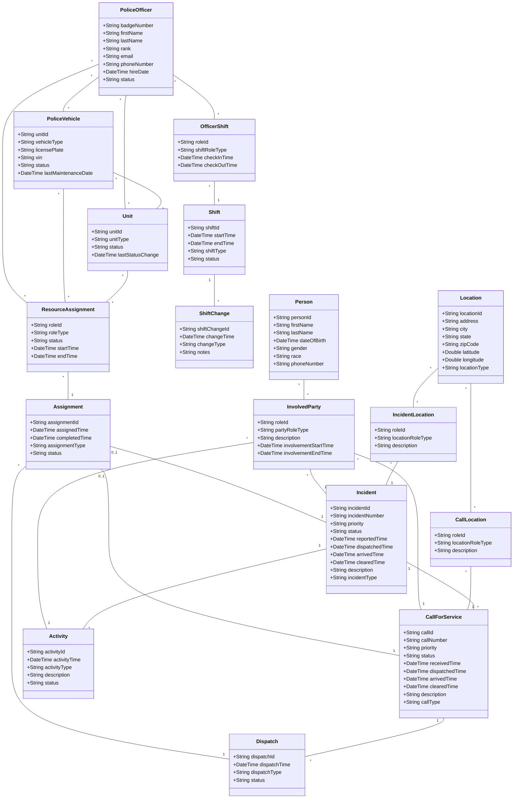

# Police Incident System Domain Model

This document describes the domain model for a police incident management system, following standard CAD (Computer Aided Dispatch) and RMS (Records Management System) terminology, aligned with NIEM (National Information Exchange Model) standards.

## Core Domain Model

## Entity Descriptions

### PoliceOfficer
Represents a sworn law enforcement officer. Key identifier is the badge number. Status can be: Active, On-Duty, Off-Duty, Suspended, Retired.

### PoliceVehicle
A physical vehicle used by the police department. Each vehicle has a unique unit identifier. Status can be: Available, Assigned, In-Use, Maintenance, Out-of-Service.

### Unit
A more general concept representing any deployable resource. Can be a single officer, a vehicle, or a team. This follows standard CAD terminology where "Unit" is the primary dispatchable entity.

### Incident
A significant event requiring police response. An incident may contain multiple calls for service and involve multiple units. This is the higher-level concept that groups related activities.

### CallForService
A specific request for police assistance. In CAD terminology, this is often called a "Call" or "CAD Call". Multiple calls can be associated with a single incident. Priority levels typically include: Emergency, High, Medium, Low.

### Location
Geographic location where an incident or call occurs. Can be a street address, coordinates, or a named location.

### Assignment
A moment-interval representing the assignment of resources to an incident or call. Tracks when the assignment was made and completed. An assignment is for either an Incident or a CallForService (but not both).

### Shift
Represents a work period. Tracks start and end times, and shift type (Day, Evening, Night, etc.).

### ShiftChange
Documents the transition between shifts, including briefing information and status handoffs.

### Person
Any individual in the system. Represents the physical person (Party/Place/Thing archetype). Involvement in incidents, calls, or activities is tracked through InvolvedParty.

### Activity
Specific actions taken during an incident, such as arrests, interviews, evidence collection, reports filed, etc.

### Dispatch
The act of assigning units to calls or incidents. Tracks who dispatched, when, and the dispatch type (Initial, Additional, Cancellation, etc.).

### ResourceAssignment
A role that connects a resource (PoliceOfficer, PoliceVehicle, or Unit) to an Assignment. The roleType indicates the type of role (Primary, Backup, Supervisor, etc.). This follows Modeling in Color principles by separating Party/Place/Thing (resources) from Moment-Interval (Assignment) through a Role.

### InvolvedParty
A role that connects a Person to an Incident, CallForService, or Activity. The partyRoleType indicates how the person is involved (Victim, Suspect, Witness, Complainant, etc.). This separates the physical Person from the events (Moment-Intervals) through a Role.

### OfficerShift
A role that connects a PoliceOfficer to a Shift. Tracks check-in and check-out times, and the type of role the officer plays in the shift (Regular, Supervisor, Trainee, etc.).

### IncidentLocation
A role that connects a Location to an Incident. The locationRoleType can indicate the type of location (Primary, Secondary, Related, etc.) and any additional context.

### CallLocation
A role that connects a Location to a CallForService. Similar to IncidentLocation, but specific to calls.

## Notes

### Modeling in Color Archetypes

This model follows the "Modeling in Color" methodology by Peter Coad:

- **Green (Party/Place/Thing - PPT)**: Physical entities that exist independently
  - `PoliceOfficer`, `PoliceVehicle`, `Unit`, `Person`, `Location`
  
- **Pink (Moment-Interval - MI)**: Events or processes that occur over time
  - `Incident`, `CallForService`, `Activity`, `Assignment`, `Shift`, `ShiftChange`, `Dispatch`
  
- **Yellow (Role)**: Roles that PPTs play in MIs, mediating the relationship
  - `ResourceAssignment`, `InvolvedParty`, `OfficerShift`, `IncidentLocation`, `CallLocation`

**Key Principle**: PPTs should not directly associate with MIs. Instead, they associate through Role entities. This separation provides:
- Flexibility: A person can play different roles in different incidents
- Clarity: The role captures the relationship context
- Extensibility: New roles can be added without changing PPT or MI entities

### Domain-Specific Notes

- **Incident vs CallForService**: An Incident is a broader event that may span multiple calls. For example, a major accident might generate multiple calls (traffic control, medical assistance, investigation) but be tracked as one incident.

- **Assignment Structure**: An Assignment is a Moment-Interval that connects resources (via ResourceAssignment) to either an Incident or a CallForService. The 0..1 multiplicity on both Incident and CallForService indicates that an assignment is for exactly one of them (XOR relationship).

- **Unit Assignment**: Officers can be assigned to vehicles, and both can be part of a Unit. The Unit is the primary dispatchable entity in most CAD systems.

- **Multiplicity**: All associations specify cardinality to ensure data integrity and clear relationships.

- **Status Fields**: Most entities have status fields to track their current state, which is critical for real-time dispatch operations.

