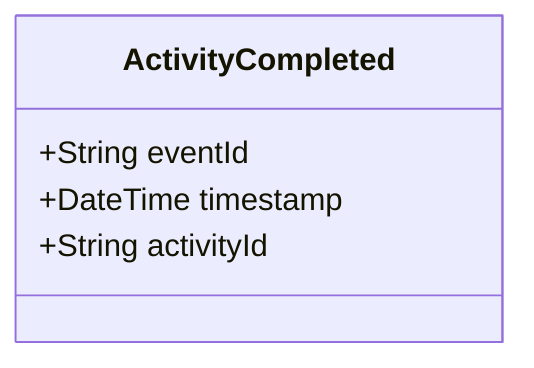

# ActivityCompleted

## Description

This event is raised when an activity is completed.

## UML Class Diagram

## Domain Model Effect

- **Modifies**: The existing `Activity` entity identified by `activityId`
- **Status Transition**: The activity status is updated to "Completed"
- **Note**: The `activityTime` attribute remains unchanged as it represents when the activity started

