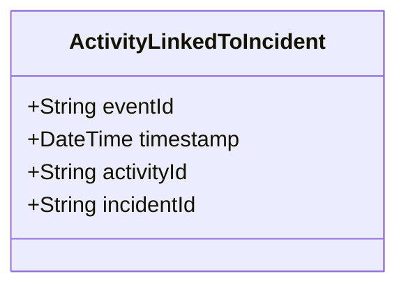

# ActivityLinkedToIncident

## Description

This event is raised when an activity is linked to an incident.

## UML Class Diagram

## Domain Model Effect

- **Modifies**: The existing `Activity` entity identified by `activityId`
- **Relationships**: The Activity is linked to the Incident identified by `incidentId`
- **Note**: This establishes the relationship where an Incident can contain multiple Activity entities

