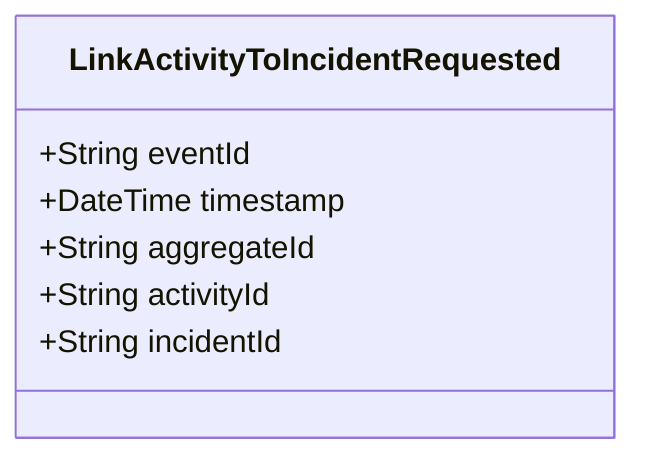

# LinkActivityToIncidentRequested

## Description

This event represents a request to link an activity to an incident. It is published to Kafka when an activity is linked to an incident via the REST API. This is a request/command event, not a state change event.

## UML Class Diagram

## Domain Model Effect

This event represents a **request** to link an activity to an incident. The actual relationship creation and state management happens in downstream services that consume this event.

- **Request Type**: Link request to associate an activity with an incident
- **Aggregate Identifier**: The `activityId` is used as `aggregateId`
- **Requested Attributes**: Both `activityId` and `incidentId` are included in the request
- **Relationship**: The event represents a request to establish a relationship between the Activity and Incident entities
