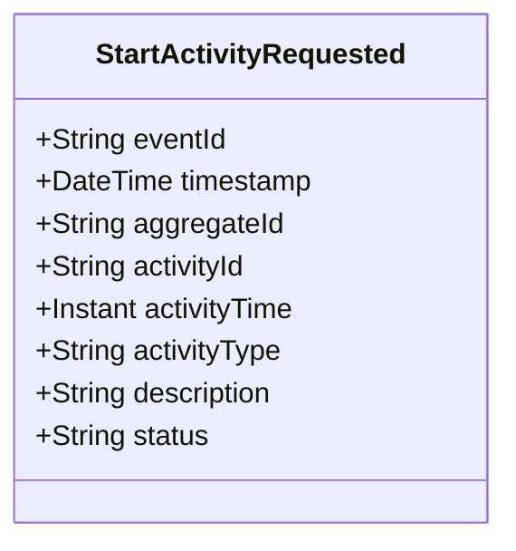

# StartActivityRequested

## Description

This event represents a request to start an activity. It is published to Kafka when an activity start is requested via the REST API. This is a request/command event, not a state change event.

## UML Class Diagram

## Domain Model Effect

This event represents a **request** to create a new `Activity` entity. The actual creation and state management happens in downstream services that consume this event.

- **Request Type**: Start request for a new activity
- **Entity Identifier**: The `activityId` serves as the unique identifier (also used as `aggregateId`)
- **Requested Attributes**: All provided attributes (activityTime, activityType, description, status) are included in the request
- **Status**: The `status` attribute is provided in the request (typically "Started" or "In-Progress")
- **Timestamps**: The `activityTime` is provided as an Instant
- **Enum Values**: The `activityType` and `status` are provided as string enum names
