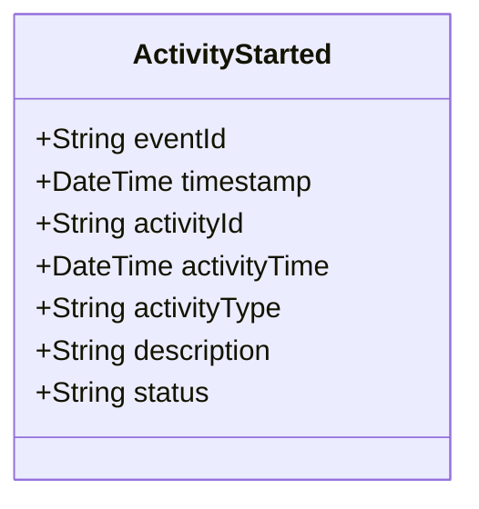

# ActivityStarted

## Description

This event is raised when an activity is started (e.g., arrest, interview, evidence collection).

## UML Class Diagram

## Domain Model Effect

- **Creates**: A new `Activity` entity with the provided attributes
- **Entity Identifier**: The `activityId` serves as the unique identifier
- **Initial Status**: The `status` attribute is set to the provided value (typically "In Progress" or "Active")
- **Attributes**: All provided attributes (activityId, activityTime, activityType, description, status) are set on the new Activity entity
- **Timestamps**: The `activityTime` is set to the provided value (typically the event timestamp)

