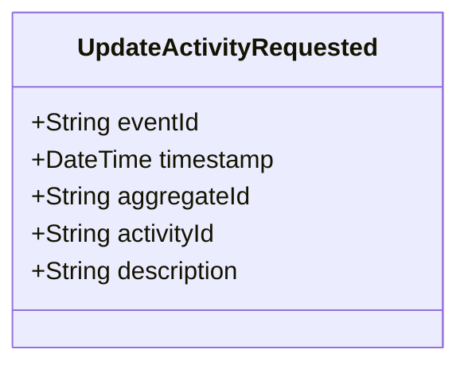

# UpdateActivityRequested

## Description

This event represents a request to update an existing activity's information. It is published to Kafka when an activity update is requested via the REST API. This is a request/command event, not a state change event.

## UML Class Diagram

## Domain Model Effect

This event represents a **request** to update an existing `Activity` entity. The actual update and state management happens in downstream services that consume this event.

- **Request Type**: Update request for an existing activity
- **Entity Identifier**: The `activityId` identifies the activity to update (also used as `aggregateId`)
- **Updated Attributes**: The `description` is included in the update request if provided
- **Note**: The `activityId` cannot be changed as it serves as the entity identifier
- **Note**: Status changes should use the `ChangeActivityStatusRequested` event instead
- **Note**: The `activityTime` attribute should not be changed as it represents when the activity started
