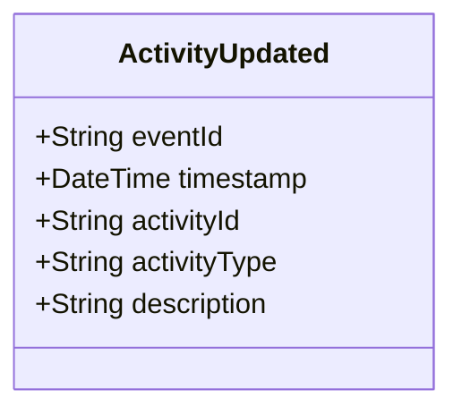

# ActivityUpdated

## Description

This event is raised when an existing activity's information is updated (excluding status changes, which use ActivityStatusChanged).

## UML Class Diagram

## Domain Model Effect

- **Modifies**: The existing `Activity` entity identified by `activityId`
- **Updated Attributes**: All provided attributes (activityType, description) are updated on the Activity entity
- **Note**: The `activityId` cannot be changed as it serves as the entity identifier
- **Note**: Status changes should use the `ActivityStatusChanged` event instead
- **Note**: The `activityTime` attribute should not be changed as it represents when the activity started

