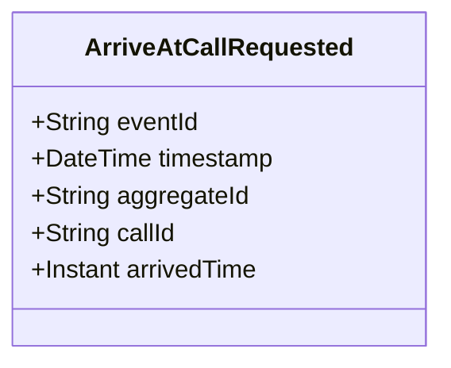

# ArriveAtCallRequested

## Description

This event represents a request to record arrival at a call location. It is published to Kafka when an arrival is requested via the REST API. This is a request/command event, not a state change event.

## UML Class Diagram

## Domain Model Effect

This event represents a **request** to record arrival at a call location. The actual arrival processing and state management happens in downstream services that consume this event.

- **Request Type**: Arrival request for a call
- **Entity Identifier**: The `callId` identifies the call where arrival is recorded (also used as `aggregateId`)
- **Requested Attributes**: The `arrivedTime` is included in the request
- **Timestamps**: The `arrivedTime` is provided as an Instant
- **State Transition**: The event represents a request to transition the call to an arrived state
