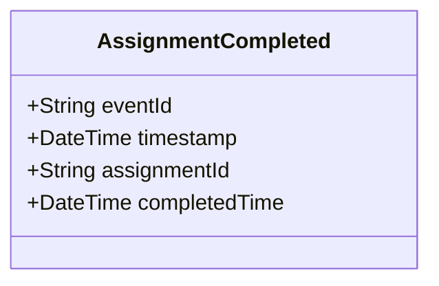

# AssignmentCompleted

## Description

This event is raised when an assignment is completed.

## UML Class Diagram

## Domain Model Effect

- **Modifies**: The existing `Assignment` entity identified by `assignmentId`
- **Timestamp Update**: The `completedTime` attribute of the Assignment is set to the provided `completedTime` (typically the event timestamp)
- **Status Transition**: The assignment status typically transitions to "Completed"

