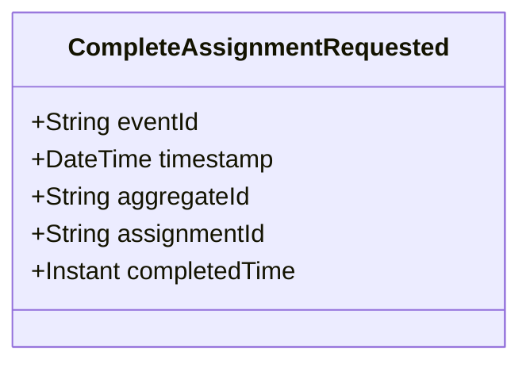

# CompleteAssignmentRequested

## Description

This event represents a request to complete an assignment. It is published to Kafka when an assignment completion is requested via the REST API. This is a request/command event, not a state change event.

## UML Class Diagram

## Domain Model Effect

This event represents a **request** to complete an assignment. The actual completion processing and state management happens in downstream services that consume this event.

- **Request Type**: Completion request for an assignment
- **Entity Identifier**: The `assignmentId` identifies the assignment to complete (also used as `aggregateId`)
- **Requested Attributes**: The `completedTime` is included in the request
- **Timestamps**: The `completedTime` is provided as an Instant
- **State Transition**: The event represents a request to transition the assignment to a completed state
