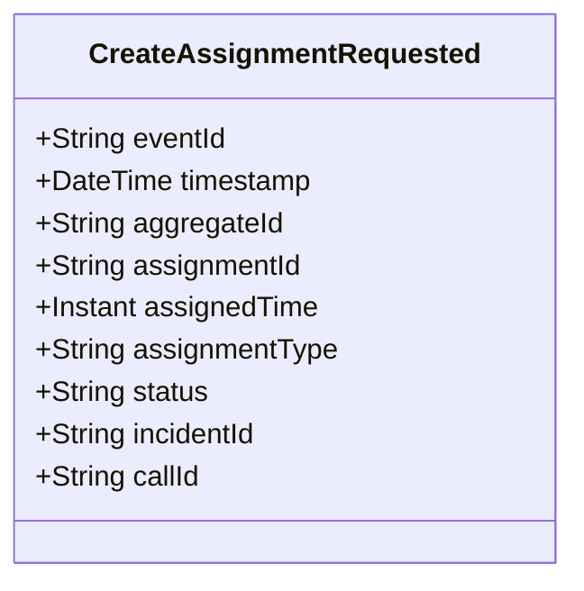

# CreateAssignmentRequested

## Description

This event represents a request to create an assignment. It is published to Kafka when an assignment creation is requested via the REST API. This is a request/command event, not a state change event.

## UML Class Diagram

## Domain Model Effect

This event represents a **request** to create a new `Assignment` entity. The actual creation and state management happens in downstream services that consume this event.

- **Request Type**: Creation request for a new assignment
- **Entity Identifier**: The `assignmentId` serves as the unique identifier (also used as `aggregateId`)
- **Requested Attributes**: All provided attributes (assignedTime, assignmentType, status) are included in the request
- **Status**: The `status` attribute is provided in the request (typically "Created")
- **Timestamps**: The `assignedTime` is provided as an Instant
- **Enum Values**: The `assignmentType` and `status` are provided as string enum names
- **Relationships**: Exactly one of `incidentId` or `callId` must be provided (mutually exclusive)
