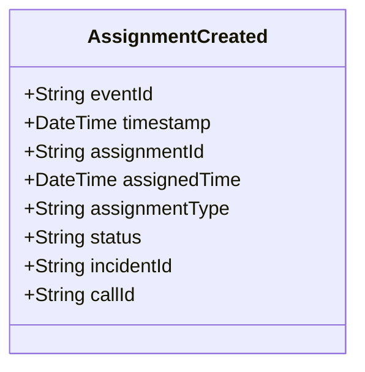

# AssignmentCreated

## Description

This event is raised when a new assignment is created, assigning resources to an incident or call for service.

## UML Class Diagram

## Domain Model Effect

- **Creates**: A new `Assignment` entity with the provided attributes
- **Entity Identifier**: The `assignmentId` serves as the unique identifier
- **Initial Status**: The `status` attribute is set to the provided value (typically "Active")
- **Attributes**: All provided attributes (assignmentId, assignedTime, assignmentType, status) are set on the new Assignment entity
- **Relationships**: 
  - If `incidentId` is provided, the Assignment is linked to the Incident (exactly one of incidentId or callId must be provided, but not both)
  - If `callId` is provided, the Assignment is linked to the CallForService
- **Timestamps**: The `assignedTime` is set to the provided value (typically the event timestamp)

