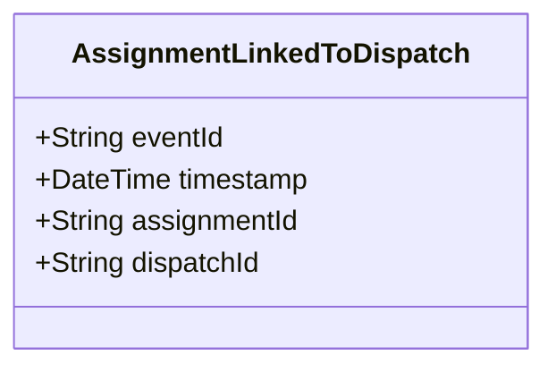

# AssignmentLinkedToDispatch

## Description

This event is raised when an assignment is linked to a dispatch.

## UML Class Diagram

## Domain Model Effect

- **Modifies**: The existing `Assignment` entity identified by `assignmentId`
- **Relationships**: The Assignment is linked to the Dispatch identified by `dispatchId`
- **Note**: This establishes the relationship where a Dispatch can contain multiple Assignment entities

