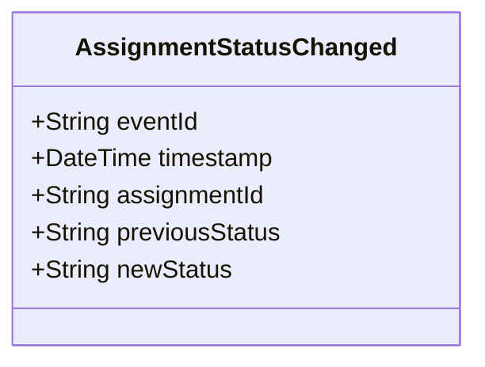

# AssignmentStatusChanged

## Description

This event is raised when an assignment's status changes.

## UML Class Diagram

## Domain Model Effect

- **Modifies**: The existing `Assignment` entity identified by `assignmentId`
- **Status Update**: The `status` attribute of the Assignment is updated from `previousStatus` to `newStatus`
- **State Transition**: The event documents the state transition for audit purposes

