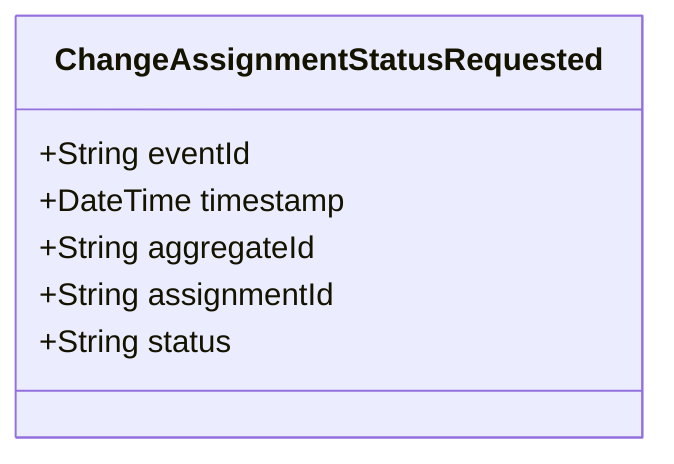

# ChangeAssignmentStatusRequested

## Description

This event represents a request to change an assignment's status. It is published to Kafka when an assignment status change is requested via the REST API. This is a request/command event, not a state change event.

## UML Class Diagram

## Domain Model Effect

This event represents a **request** to change the status of an existing `Assignment` entity. The actual status change and state management happens in downstream services that consume this event.

- **Request Type**: Status change request for an existing assignment
- **Entity Identifier**: The `assignmentId` identifies the assignment whose status should be changed (also used as `aggregateId`)
- **Status Update**: The `status` attribute contains the requested new status value
- **Valid Status Values**: Created, Assigned, In-Progress, Completed, Cancelled
- **State Transition**: The event represents a request for a state transition, which will be processed by downstream services
