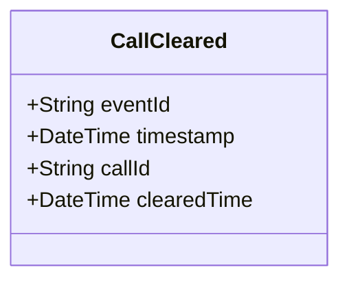

# CallCleared

## Description

This event is raised when a call for service is cleared or completed.

## UML Class Diagram

## Domain Model Effect

- **Modifies**: The existing `CallForService` entity identified by `callId`
- **Timestamp Update**: The `clearedTime` attribute of the CallForService is set to the provided `clearedTime` (typically the event timestamp)
- **Status Transition**: The call status typically transitions to "Cleared" or "Completed"

