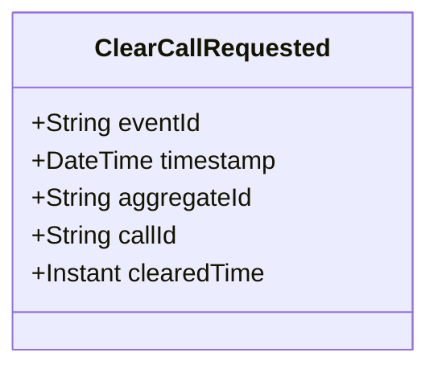

# ClearCallRequested

## Description

This event represents a request to clear a call. It is published to Kafka when a call clear is requested via the REST API. This is a request/command event, not a state change event.

## UML Class Diagram

## Domain Model Effect

This event represents a **request** to clear a call. The actual clear processing and state management happens in downstream services that consume this event.

- **Request Type**: Clear request for a call
- **Entity Identifier**: The `callId` identifies the call to clear (also used as `aggregateId`)
- **Requested Attributes**: The `clearedTime` is included in the request
- **Timestamps**: The `clearedTime` is provided as an Instant
- **State Transition**: The event represents a request to transition the call to a cleared state
