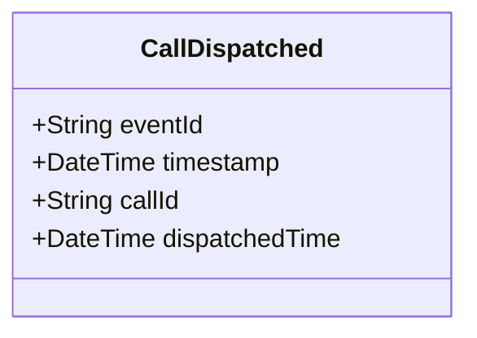

# CallDispatched

## Description

This event is raised when a call for service is dispatched to units.

## UML Class Diagram

## Domain Model Effect

- **Modifies**: The existing `CallForService` entity identified by `callId`
- **Timestamp Update**: The `dispatchedTime` attribute of the CallForService is set to the provided `dispatchedTime` (typically the event timestamp)
- **Status Transition**: The call status typically transitions to "Dispatched" or "In Progress"

