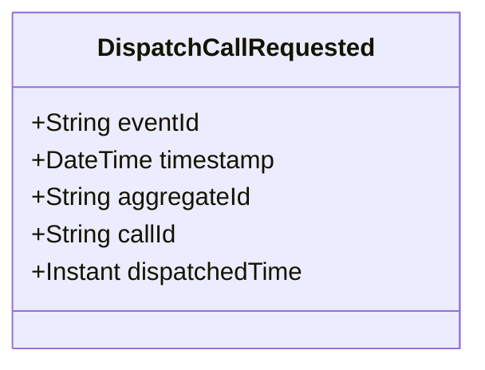

# DispatchCallRequested

## Description

This event represents a request to dispatch a call to units. It is published to Kafka when a call dispatch is requested via the REST API. This is a request/command event, not a state change event.

## UML Class Diagram

## Domain Model Effect

This event represents a **request** to dispatch a call. The actual dispatch processing and state management happens in downstream services that consume this event.

- **Request Type**: Dispatch request for a call
- **Entity Identifier**: The `callId` identifies the call to dispatch (also used as `aggregateId`)
- **Requested Attributes**: The `dispatchedTime` is included in the request
- **Timestamps**: The `dispatchedTime` is provided as an Instant
- **State Transition**: The event represents a request to transition the call to a dispatched state
