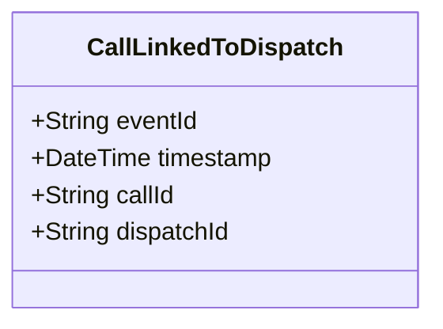

# CallLinkedToDispatch

## Description

This event is raised when a call for service is linked to a dispatch.

## UML Class Diagram

## Domain Model Effect

- **Modifies**: The existing `CallForService` entity identified by `callId`
- **Relationships**: The CallForService is linked to the Dispatch identified by `dispatchId`
- **Note**: This establishes the relationship where a CallForService can have multiple Dispatch entities

