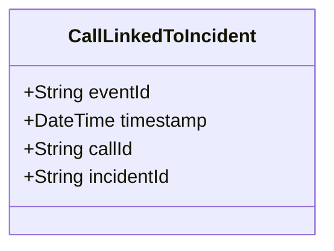

# CallLinkedToIncident

## Description

This event is raised when a call for service is linked to an incident.

## UML Class Diagram

## Domain Model Effect

- **Modifies**: The existing `CallForService` entity identified by `callId`
- **Relationships**: The CallForService is linked to the Incident identified by `incidentId`
- **Note**: This establishes the relationship where an Incident can contain multiple CallForService entities

