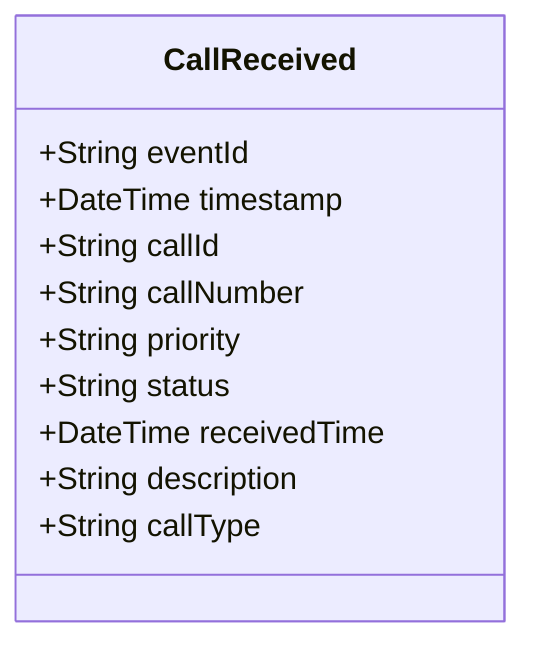

# CallReceived

## Description

This event is raised when a new call for service is received in the system.

## UML Class Diagram

## Domain Model Effect

- **Creates**: A new `CallForService` entity with the provided attributes
- **Entity Identifier**: The `callId` serves as the unique identifier
- **Initial Status**: The `status` attribute is set to the provided value (typically "Received")
- **Attributes**: All provided attributes (callId, callNumber, priority, status, receivedTime, description, callType) are set on the new CallForService entity
- **Timestamps**: The `receivedTime` is set to the provided value (typically the event timestamp)

