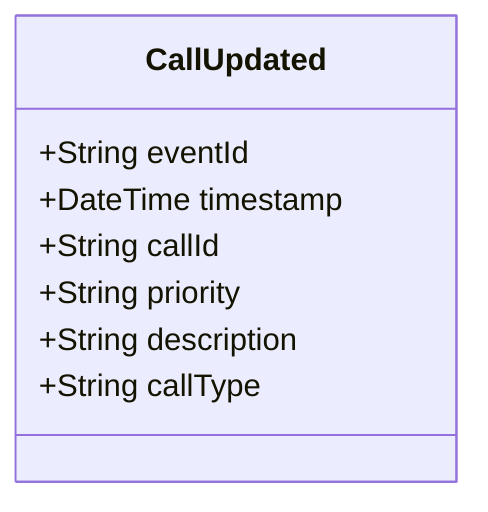

# CallUpdated

## Description

This event is raised when an existing call for service's information is updated (excluding status changes, which use CallStatusChanged).

## UML Class Diagram

## Domain Model Effect

- **Modifies**: The existing `CallForService` entity identified by `callId`
- **Updated Attributes**: All provided attributes (priority, description, callType) are updated on the CallForService entity
- **Note**: The `callId` and `callNumber` cannot be changed as they serve as entity identifiers
- **Note**: Status changes should use the `CallStatusChanged` event instead
- **Note**: Timestamp fields (receivedTime, dispatchedTime, arrivedTime, clearedTime) should use their specific events

