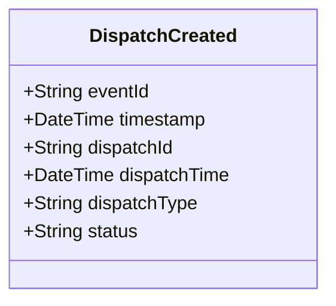

# DispatchCreated

## Description

This event is raised when a new dispatch is created, assigning units to calls or incidents.

## UML Class Diagram

## Domain Model Effect

- **Creates**: A new `Dispatch` entity with the provided attributes
- **Entity Identifier**: The `dispatchId` serves as the unique identifier
- **Initial Status**: The `status` attribute is set to the provided value (typically "Active")
- **Attributes**: All provided attributes (dispatchId, dispatchTime, dispatchType, status) are set on the new Dispatch entity
- **Timestamps**: The `dispatchTime` is set to the provided value (typically the event timestamp)
- **Note**: The relationships to CallForService and Assignment are established through separate events or commands

