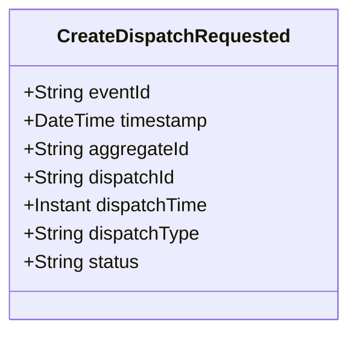

# CreateDispatchRequested

## Description

This event represents a request to create a new dispatch. It is published to Kafka when a dispatch creation is requested via the REST API. This is a request/command event, not a state change event.

## UML Class Diagram

## Domain Model Effect

This event represents a **request** to create a new `Dispatch` entity. The actual creation and state management happens in downstream services that consume this event.

- **Request Type**: Creation request for a new dispatch
- **Entity Identifier**: The `dispatchId` serves as the unique identifier (also used as `aggregateId`)
- **Requested Attributes**: All provided attributes (dispatchTime, dispatchType, status) are included in the request
- **Status**: The `status` attribute is provided in the request (typically "Created")
- **Timestamps**: The `dispatchTime` is provided as an Instant
- **Enum Values**: The `dispatchType` and `status` are provided as string enum names
