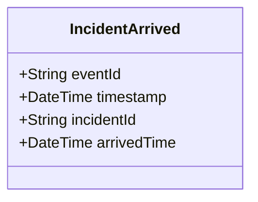

# IncidentArrived

## Description

This event is raised when units arrive at the incident location.

## UML Class Diagram

## Domain Model Effect

- **Modifies**: The existing `Incident` entity identified by `incidentId`
- **Timestamp Update**: The `arrivedTime` attribute of the Incident is set to the provided `arrivedTime` (typically the event timestamp)
- **Status Transition**: The incident status typically transitions to "On Scene" or "In Progress"

