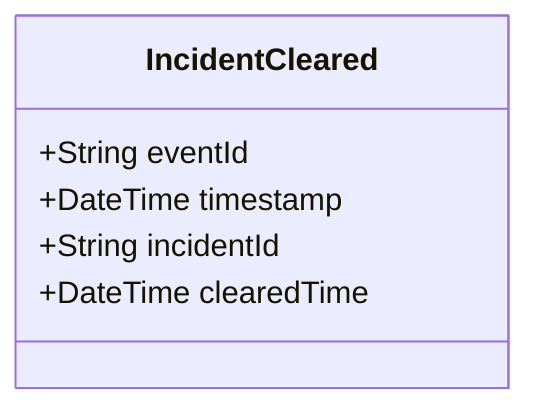

# IncidentCleared

## Description

This event is raised when an incident is cleared or completed.

## UML Class Diagram

## Domain Model Effect

- **Modifies**: The existing `Incident` entity identified by `incidentId`
- **Timestamp Update**: The `clearedTime` attribute of the Incident is set to the provided `clearedTime` (typically the event timestamp)
- **Status Transition**: The incident status typically transitions to "Cleared" or "Completed"

