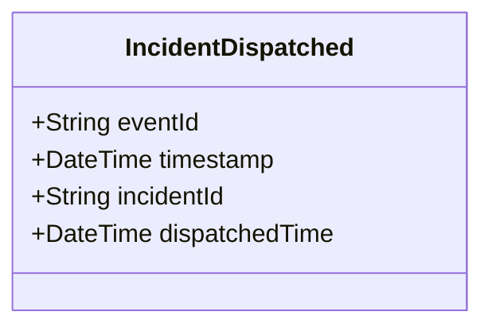

# IncidentDispatched

## Description

This event is raised when an incident is dispatched to units.

## UML Class Diagram

## Domain Model Effect

- **Modifies**: The existing `Incident` entity identified by `incidentId`
- **Timestamp Update**: The `dispatchedTime` attribute of the Incident is set to the provided `dispatchedTime` (typically the event timestamp)
- **Status Transition**: The incident status typically transitions to "Dispatched" or "In Progress"

