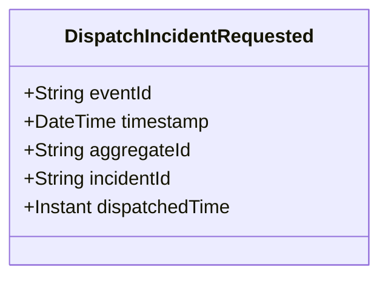

# DispatchIncidentRequested

## Description

This event represents a request to dispatch an incident to units. It is published to Kafka when an incident dispatch is requested via the REST API. This is a request/command event, not a state change event.

## UML Class Diagram

## Domain Model Effect

This event represents a **request** to dispatch an incident. The actual dispatch processing and state management happens in downstream services that consume this event.

- **Request Type**: Dispatch request for an incident
- **Entity Identifier**: The `incidentId` identifies the incident to dispatch (also used as `aggregateId`)
- **Requested Attributes**: The `dispatchedTime` is included in the request
- **Timestamps**: The `dispatchedTime` is provided as an Instant
- **State Transition**: The event represents a request to transition the incident to a dispatched state
