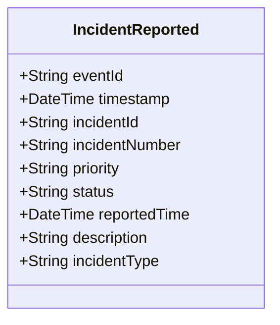

# IncidentReported

## Description

This event is raised when a new incident is reported in the system.

## UML Class Diagram

## Domain Model Effect

- **Creates**: A new `Incident` entity with the provided attributes
- **Entity Identifier**: The `incidentId` serves as the unique identifier
- **Initial Status**: The `status` attribute is set to the provided value (typically "Reported")
- **Attributes**: All provided attributes (incidentId, incidentNumber, priority, status, reportedTime, description, incidentType) are set on the new Incident entity
- **Timestamps**: The `reportedTime` is set to the provided value (typically the event timestamp)

