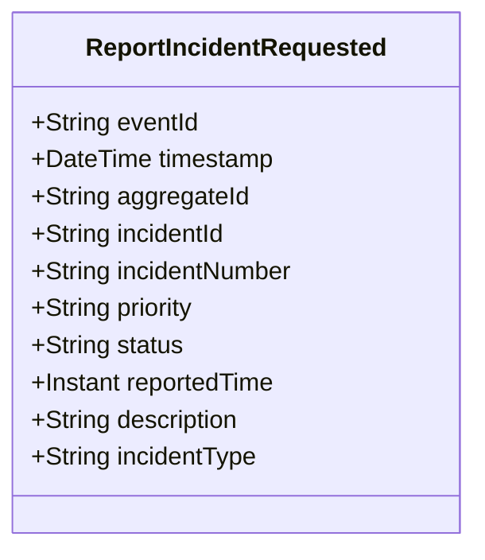

# ReportIncidentRequested

## Description

This event represents a request to report a new incident. It is published to Kafka when an incident report is requested via the REST API. This is a request/command event, not a state change event.

## UML Class Diagram

## Domain Model Effect

This event represents a **request** to create a new `Incident` entity. The actual creation and state management happens in downstream services that consume this event.

- **Request Type**: Report request for a new incident
- **Entity Identifier**: The `incidentId` serves as the unique identifier (also used as `aggregateId`)
- **Requested Attributes**: All provided attributes (incidentNumber, priority, status, reportedTime, description, incidentType) are included in the request
- **Status**: The `status` attribute is provided in the request (typically "Reported")
- **Timestamps**: The `reportedTime` is provided as an Instant
- **Enum Values**: The `priority` and `incidentType` are provided as string enum names
