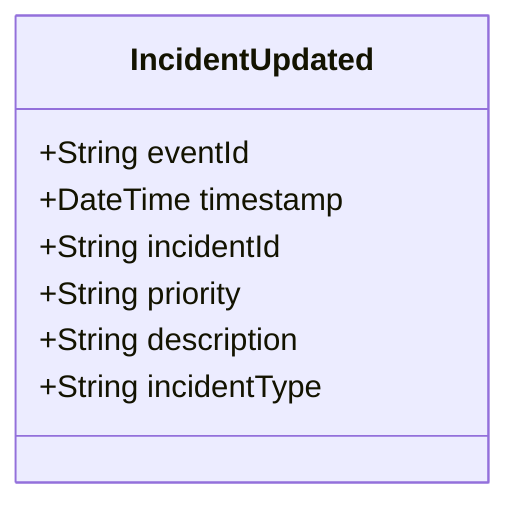

# IncidentUpdated

## Description

This event is raised when an existing incident's information is updated (excluding status changes, which use IncidentStatusChanged).

## UML Class Diagram

## Domain Model Effect

- **Modifies**: The existing `Incident` entity identified by `incidentId`
- **Updated Attributes**: All provided attributes (priority, description, incidentType) are updated on the Incident entity
- **Note**: The `incidentId` and `incidentNumber` cannot be changed as they serve as entity identifiers
- **Note**: Status changes should use the `IncidentStatusChanged` event instead
- **Note**: Timestamp fields (reportedTime, dispatchedTime, arrivedTime, clearedTime) should use their specific events

