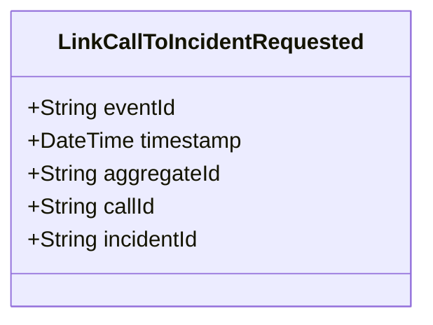

# LinkCallToIncidentRequested

## Description

This event represents a request to link a call to an incident. It is published to Kafka when a call is linked to an incident via the REST API. This is a request/command event, not a state change event.

## UML Class Diagram

## Domain Model Effect

This event represents a **request** to link a call to an incident. The actual relationship creation and state management happens in downstream services that consume this event.

- **Request Type**: Link request to associate a call with an incident
- **Aggregate Identifier**: The `callId` is used as `aggregateId`
- **Requested Attributes**: Both `callId` and `incidentId` are included in the request
- **Relationship**: The event represents a request to establish a relationship between the CallForService and Incident entities
