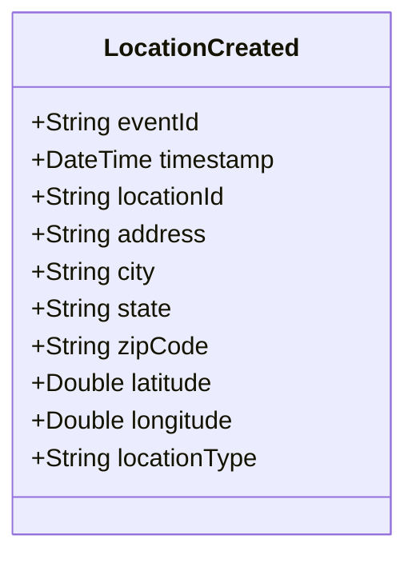

# LocationCreated

## Description

This event is raised when a new location is created in the system.

## UML Class Diagram

## Domain Model Effect

- **Creates**: A new `Location` entity with the provided attributes
- **Entity Identifier**: The `locationId` serves as the unique identifier
- **Attributes**: All provided attributes (locationId, address, city, state, zipCode, latitude, longitude, locationType) are set on the new Location entity

