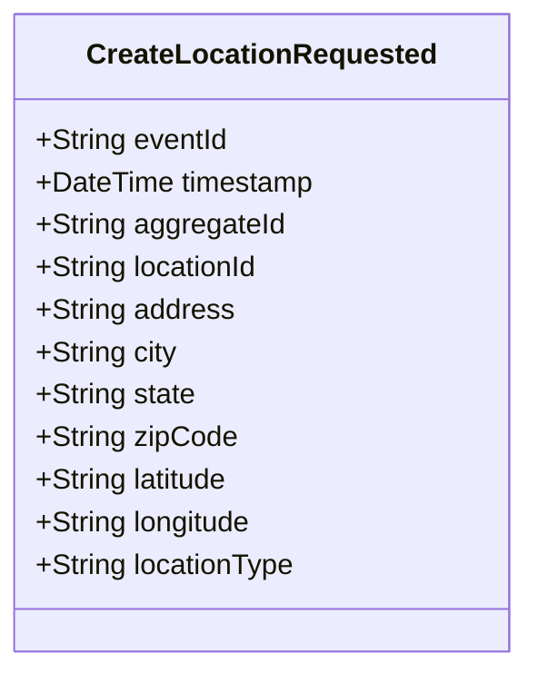

# CreateLocationRequested

## Description

This event represents a request to create a new location. It is published to Kafka when a location creation is requested via the REST API. This is a request/command event, not a state change event.

## UML Class Diagram

## Domain Model Effect

This event represents a **request** to create a new `Location` entity. The actual creation and state management happens in downstream services that consume this event.

- **Request Type**: Creation request for a new location
- **Entity Identifier**: The `locationId` serves as the unique identifier (also used as `aggregateId`)
- **Requested Attributes**: All provided attributes (address, city, state, zipCode, latitude, longitude, locationType) are included in the request
- **Coordinates**: The `latitude` and `longitude` are provided as strings
- **Enum Values**: The `locationType` is provided as a string enum name
