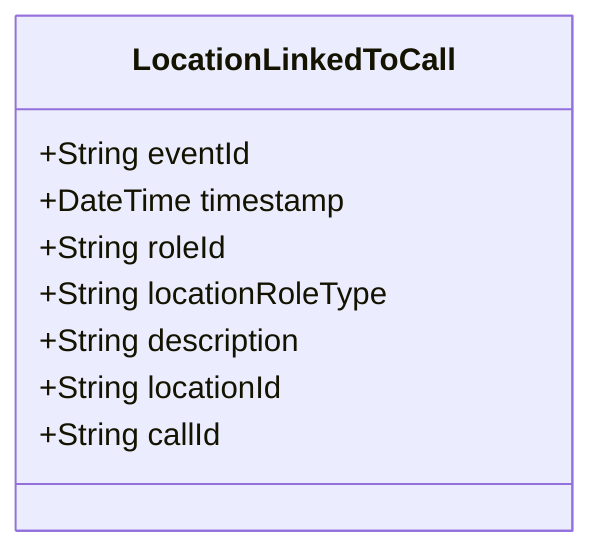

# LocationLinkedToCall

## Description

This event is raised when a location is linked to a call for service through a CallLocation role.

## UML Class Diagram

## Domain Model Effect

- **Creates**: A new `CallLocation` role entity with the provided attributes
- **Entity Identifier**: The `roleId` serves as the unique identifier
- **Attributes**: All provided attributes (roleId, locationRoleType, description) are set on the new CallLocation entity
- **Relationships**: 
  - The CallLocation is linked to the Location identified by `locationId`
  - The CallLocation is linked to the CallForService identified by `callId`
- **Role Type**: The `locationRoleType` indicates the type of location (e.g., Primary, Secondary, Related)

