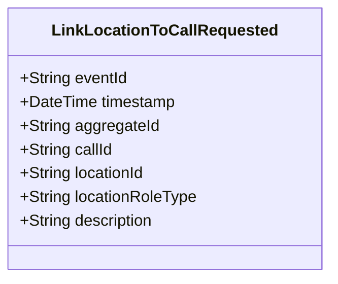

# LinkLocationToCallRequested

## Description

This event represents a request to link a location to a call for service. It is published to Kafka when a location is linked to a call via the REST API. This is a request/command event, not a state change event.

## UML Class Diagram

## Domain Model Effect

This event represents a **request** to link a location to a call for service. The actual relationship creation and state management happens in downstream services that consume this event.

- **Request Type**: Link request to associate a location with a call
- **Aggregate Identifier**: The `locationId` is used as `aggregateId`
- **Requested Attributes**: All provided attributes (callId, locationId, locationRoleType, description) are included in the request
- **Role Type**: The `locationRoleType` indicates the type of location (e.g., Primary, Secondary, Related) and is provided as a string enum name
- **Relationship**: The event represents a request to establish a relationship between the Location and CallForService entities
