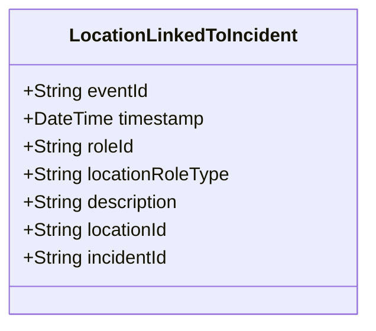

# LocationLinkedToIncident

## Description

This event is raised when a location is linked to an incident through an IncidentLocation role.

## UML Class Diagram

## Domain Model Effect

- **Creates**: A new `IncidentLocation` role entity with the provided attributes
- **Entity Identifier**: The `roleId` serves as the unique identifier
- **Attributes**: All provided attributes (roleId, locationRoleType, description) are set on the new IncidentLocation entity
- **Relationships**: 
  - The IncidentLocation is linked to the Location identified by `locationId`
  - The IncidentLocation is linked to the Incident identified by `incidentId`
- **Role Type**: The `locationRoleType` indicates the type of location (e.g., Primary, Secondary, Related)

