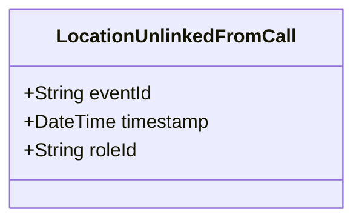

# LocationUnlinkedFromCall

## Description

This event is raised when a location is unlinked from a call for service, removing the CallLocation role.

## UML Class Diagram

## Domain Model Effect

- **Removes**: The `CallLocation` role entity identified by `roleId` is removed or marked as inactive
- **Note**: The CallLocation entity may be marked as inactive or archived, but the historical relationship may be preserved for audit purposes

