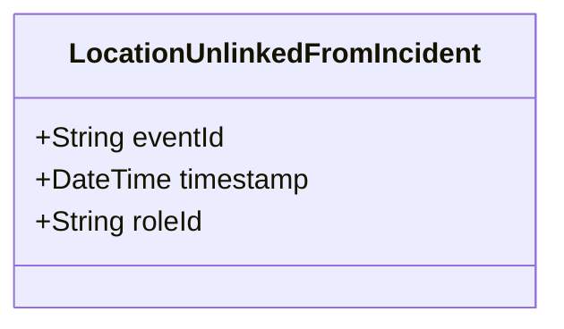

# LocationUnlinkedFromIncident

## Description

This event is raised when a location is unlinked from an incident, removing the IncidentLocation role.

## UML Class Diagram

## Domain Model Effect

- **Removes**: The `IncidentLocation` role entity identified by `roleId` is removed or marked as inactive
- **Note**: The IncidentLocation entity may be marked as inactive or archived, but the historical relationship may be preserved for audit purposes

