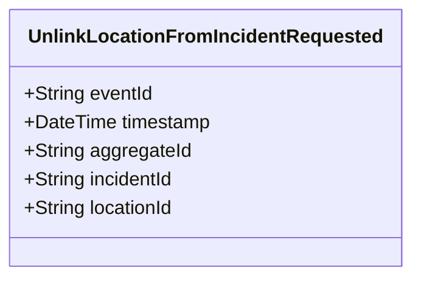

# UnlinkLocationFromIncidentRequested

## Description

This event represents a request to unlink a location from an incident. It is published to Kafka when a location is unlinked from an incident via the REST API. This is a request/command event, not a state change event.

## UML Class Diagram

## Domain Model Effect

This event represents a **request** to unlink a location from an incident. The actual relationship removal and state management happens in downstream services that consume this event.

- **Request Type**: Unlink request to remove the association between a location and an incident
- **Aggregate Identifier**: The `locationId` is used as `aggregateId`
- **Requested Attributes**: Both `incidentId` and `locationId` are included in the request to identify the relationship to remove
- **Relationship**: The event represents a request to remove the relationship between the Location and Incident entities
