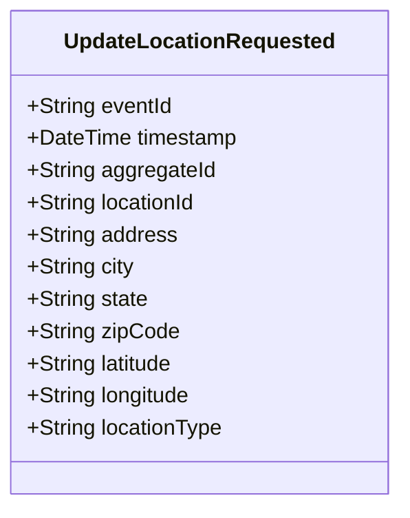

# UpdateLocationRequested

## Description

This event represents a request to update an existing location's information. It is published to Kafka when a location update is requested via the REST API. This is a request/command event, not a state change event. All fields are nullable to support partial updates - null fields mean "don't update this field".

## UML Class Diagram

## Domain Model Effect

This event represents a **request** to update an existing `Location` entity. The actual update and state management happens in downstream services that consume this event.

- **Request Type**: Update request for an existing location
- **Entity Identifier**: The `locationId` identifies the location to update (also used as `aggregateId`)
- **Partial Updates**: All fields are nullable - only non-null fields will be updated
- **Updated Attributes**: Any provided attributes (address, city, state, zipCode, latitude, longitude, locationType) are included in the update request
- **Note**: The `locationId` cannot be changed as it serves as the entity identifier
- **Coordinates**: The `latitude` and `longitude` are provided as strings if provided
- **Enum Values**: The `locationType` is provided as a string enum name if provided
