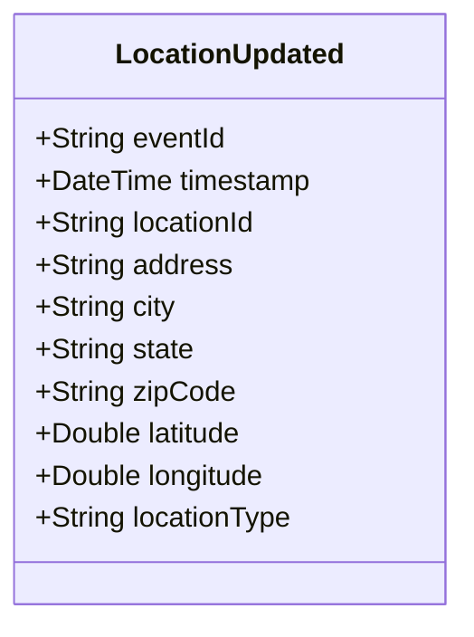

# LocationUpdated

## Description

This event is raised when an existing location's information is updated.

## UML Class Diagram

## Domain Model Effect

- **Modifies**: The existing `Location` entity identified by `locationId`
- **Updated Attributes**: All provided attributes (address, city, state, zipCode, latitude, longitude, locationType) are updated on the Location entity
- **Note**: The `locationId` cannot be changed as it serves as the entity identifier

