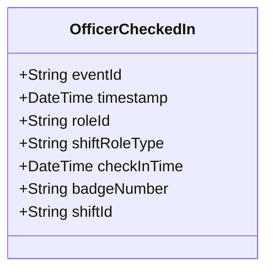

# OfficerCheckedIn

## Description

This event is raised when a police officer checks in to a shift, creating an OfficerShift role.

## UML Class Diagram

## Domain Model Effect

- **Creates**: A new `OfficerShift` role entity with the provided attributes
- **Entity Identifier**: The `roleId` serves as the unique identifier
- **Attributes**: All provided attributes (roleId, shiftRoleType, checkInTime) are set on the new OfficerShift entity
- **Relationships**: 
  - The OfficerShift is linked to the PoliceOfficer identified by `badgeNumber`
  - The OfficerShift is linked to the Shift identified by `shiftId`
- **Timestamps**: The `checkInTime` is set to the provided value (typically the event timestamp)
- **Role Type**: The `shiftRoleType` indicates the type of role the officer plays in the shift (e.g., Regular, Supervisor, Trainee)

