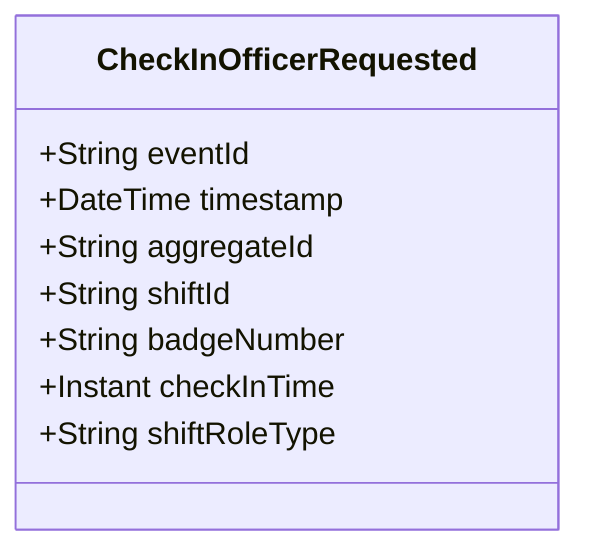

# CheckInOfficerRequested

## Description

This event represents a request to check in an officer to a shift. It is published to Kafka when an officer check-in is requested via the REST API. This is a request/command event, not a state change event.

## UML Class Diagram

## Domain Model Effect

This event represents a **request** to check in an officer to a shift. The actual check-in processing and state management happens in downstream services that consume this event.

- **Request Type**: Check-in request for an officer to a shift
- **Aggregate Identifier**: The `shiftId` is used as `aggregateId`
- **Requested Attributes**: All provided attributes (shiftId, badgeNumber, checkInTime, shiftRoleType) are included in the request
- **Timestamps**: The `checkInTime` is provided as an Instant
- **Enum Values**: The `shiftRoleType` is provided as a string enum name (e.g., Regular, Supervisor, Trainee)
- **Relationship**: The event represents a request to establish an OfficerShift relationship between the PoliceOfficer and Shift entities
