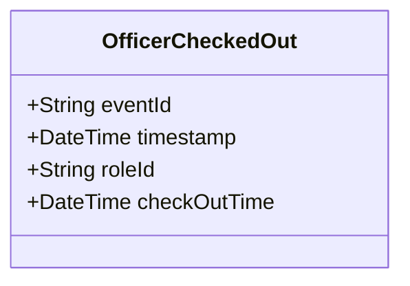

# OfficerCheckedOut

## Description

This event is raised when a police officer checks out of a shift, ending the OfficerShift role.

## UML Class Diagram

## Domain Model Effect

- **Modifies**: The existing `OfficerShift` role entity identified by `roleId`
- **Timestamp Update**: The `checkOutTime` attribute of the OfficerShift is set to the provided `checkOutTime` (typically the event timestamp)
- **Note**: The OfficerShift entity may be marked as inactive, but the historical relationship is preserved

