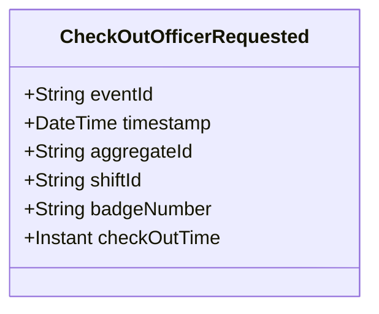

# CheckOutOfficerRequested

## Description

This event represents a request to check out an officer from a shift. It is published to Kafka when an officer check-out is requested via the REST API. This is a request/command event, not a state change event.

## UML Class Diagram

## Domain Model Effect

This event represents a **request** to check out an officer from a shift. The actual check-out processing and state management happens in downstream services that consume this event.

- **Request Type**: Check-out request for an officer from a shift
- **Aggregate Identifier**: The `shiftId` is used as `aggregateId`
- **Requested Attributes**: All provided attributes (shiftId, badgeNumber, checkOutTime) are included in the request
- **Timestamps**: The `checkOutTime` is provided as an Instant
- **Relationship**: The event represents a request to update or end the OfficerShift relationship between the PoliceOfficer and Shift entities
