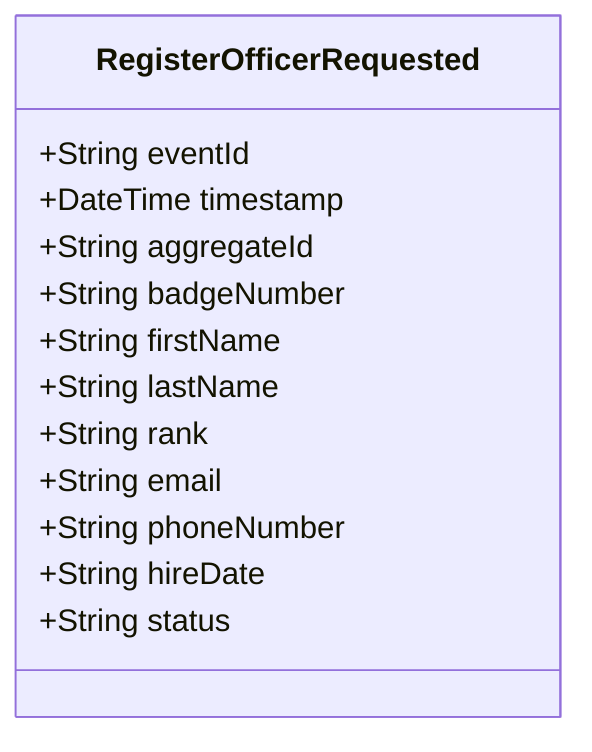

# RegisterOfficerRequested

## Description

This event represents a request to register a new police officer. It is published to Kafka when an officer registration is requested via the REST API. This is a request/command event, not a state change event.

## UML Class Diagram

## Domain Model Effect

This event represents a **request** to create a new `PoliceOfficer` entity. The actual creation and state management happens in downstream services that consume this event.

- **Request Type**: Registration request for a new police officer
- **Entity Identifier**: The `badgeNumber` serves as the unique identifier (also used as `aggregateId`)
- **Requested Attributes**: All provided attributes (firstName, lastName, rank, email, phoneNumber, hireDate, status) are included in the request
- **Status**: The `status` attribute is provided in the request (typically "Active")
- **Date Format**: The `hireDate` is provided as a string in ISO-8601 format (yyyy-MM-dd)
