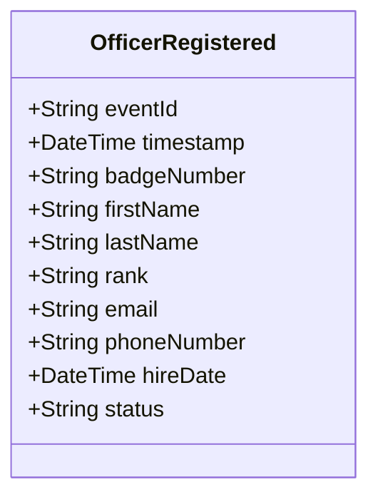

# OfficerRegistered

## Description

This event is raised when a new police officer is registered in the system.

## UML Class Diagram

## Domain Model Effect

- **Creates**: A new `PoliceOfficer` entity with the provided attributes
- **Entity Identifier**: The `badgeNumber` serves as the unique identifier
- **Initial Status**: The `status` attribute is set to the provided value (typically "Active")
- **Attributes**: All provided attributes (firstName, lastName, rank, email, phoneNumber, hireDate, status) are set on the new PoliceOfficer entity

